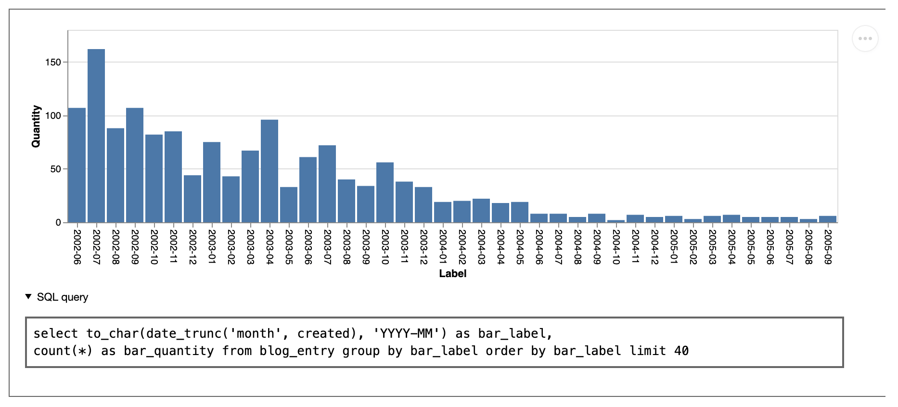
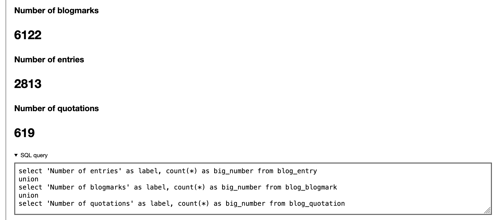
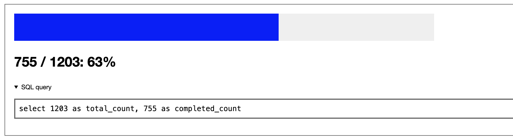
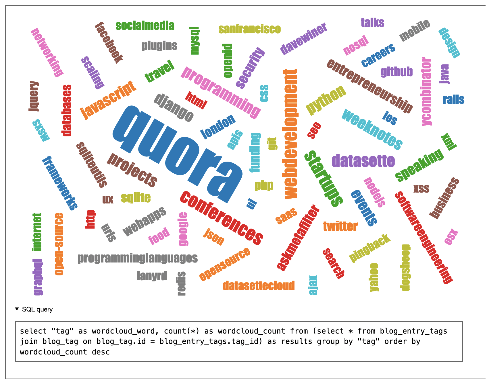

# Widgets

SQL queries default to displaying as a table. Other forms of display - called widgets - are also available, and are selected based on the names of the columns returned by the query.

## Bar chart: bar_label, bar_quantity

A query that returns columns called `bar_label` and `bar_quantity` will be rendered as a simple bar chart, using [Vega-Lite](https://vega.github.io/vega-lite/).



Bar chart live demo: [simonwillison.net/dashboard/by-month/](https://simonwillison.net/dashboard/by-month/)

SQL example:

```sql
select
  county.name as bar_label,
  count(*) as bar_quantity
from location
  join county on county.id = location.county_id
group by county.name
order by count(*) desc limit 10
```

Or using a static list of values:

```sql
SELECT * FROM (
    VALUES (1, 'one'), (2, 'two'), (3, 'three')
) AS t (bar_quantity, bar_label);
```

## Big number: big_number, label

If you want to display the results as a big number accompanied by a label, you can do so by returning `big_number` and `label` columns from your query, for example.

```sql
select 'Number of states' as label, count(*) as big_number from states;
```



Big number live demo: [simonwillison.net/dashboard/big-numbers-demo/](https://simonwillison.net/dashboard/big-numbers-demo/)

## Progress bar: completed_count, total_count

To display a progress bar, return columns `total_count` and `completed_count`.

```sql
select 1203 as total_count, 755 as completed_count;
```

This SQL pattern can be useful for constructing progress bars:
```sql
select (
  select count(*) from task
) as total_count, (
  select count(*) from task where resolved_at is not null
) as completed_count
```


Progress bar live demo: [simonwillison.net/dashboard/progress-bar-demo/](https://simonwillison.net/dashboard/progress-bar-demo/)

## Word cloud: wordcloud_count, wordcloud_word

To display a word cloud, return a column `wordcloud_word` containing words with a corresponding `wordcloud_count` column with the frequency of those words.

This example generates word clouds for article body text:
```sql
with words as (
  select
    lower(
      (regexp_matches(body, '\w+', 'g'))[1]
    ) as word
  from
    articles
)
select
  word as wordcloud_word,
  count(*) as wordcloud_count
from
  words
group by
  word
order by
  count(*) desc
```

Here's a fun variant that uses PostgreSQL's built-in stemming algorithm to first remove common stop words:

```sql
with words as (
  select
    lower(
      (regexp_matches(to_tsvector('english', body)::text, '[a-z]+', 'g'))[1]
    ) as word
  from
    articles
)
select
  word as wordcloud_word,
  count(*) as wordcloud_count
from
  words
group by
  word
order by
  count(*) desc
```



Word cloud live demo: [simonwillison.net/dashboard/tag-cloud/](https://simonwillison.net/dashboard/tag-cloud/)

## markdown

Return a single column called `markdown` to render the contents as Markdown, for example:

```sql
select '# Number of states: ' || count(*) as markdown from states;
```

## html

Return a single column called `html` to render the contents directly as HTML. This HTML is filtered using [Bleach](https://github.com/mozilla/bleach) so the only tags allowed are `a[href]`, `abbr`, `acronym`, `b`, `blockquote`, `code`, `em`, `i`, `li`, `ol`, `strong`, `ul`, `pre`, `p`, `h1`, `h2`, `h3`, `h4`, `h5`, `h6`.

```sql
select '<h1>Number of states: ' || count(*) || '</h1>' as html from states;
```

# Custom widgets

You can define your own custom widgets by creating templates with special names.

Decide on the column names that you wish to customize for, then sort them alphabetically and join them with hyphens to create your template name.

For example, you could define a widget that handles results returned as `placename`, `geojson` by creating a template called `geojson-placename.html`.

Save that in one of your template directories as `django_sql_dashboard/widgets/geojson-placename.html`.

Any SQL query that returns exactly the columns `placename` and `geojson` will now be rendered by your custom template file.

Within your custom template you will have access to a template variable called `result` with the following keys:

- `result.sql` - the SQL query that is being displayed
- `rows` - a list of rows, where each row is a dictionary mapping columns to their values
- `row_lists` - a list of rows, where each row is a list of the values in that row
- `description` - the psycopg2 cursor description
- `columns` - a list of string column names
- `column_details` - a list of `{"name": column_name, "is_unambiguous": True or False}` dictionaries - `is_unambiguous` is `False` if multiple columns of the same name are returned by this query
- `truncated` - boolean, specifying whether the results were truncated (at 100 items) or not
- `extra_qs` - extra parameters for the page encoded as a query string fragment - so if the page was loaded with `state_id=5` then `extra_qs` would be `&state_id=5`. You can use this to assemble links to further queries, like the "Count" column links in the default table view.
- `duration_ms` - how long the query took, in floating point milliseconds
- `templates` - a list of templates that were considered for rendering this widget

The easiest way to define your custom widget template is to extend the `django_sql_dashboard/widgets/_base_widget.html` base template.

Here is the full implementation of the `big_number`, `label` widget that is included with Django SQL Dashboard, in the `django_sql_dashboard/widgets/big_number-label.html` template file:

```html+django



  
    <div class="big-number">
      <p><strong>{{ row.label }}</strong></p>
      <h1>{{ row.big_number }}</h1>
    </div>
  

```

You can find more examples of widget templates in the [templates/django_sql_dashboard/widgets](https://github.com/simonw/django-sql-dashboard/tree/main/django_sql_dashboard/templates/django_sql_dashboard/widgets) directory.
